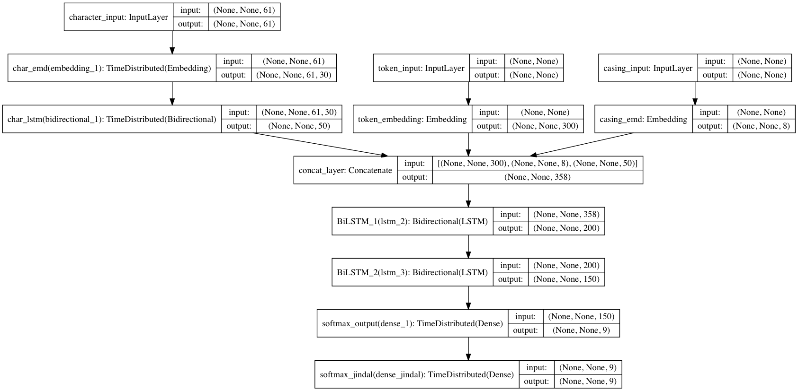

# Results

Verifying Jindal's results, params for this experiment:

- batch_size = 128
- epochs = 20
- dropout = 0.1

## Model from Keras Tutorial

| Model | Noise | achieved Acc. | claimed Acc. |
| ------ | ------ | ------ | ------ |
| Baseline | 0% | 98% | 98% |
||||
| Baseline | 30% | 96% | 97% |
| Baseline | 50% | 91% | 77% |
| Baseline | 70% | 81% | 55% |
| Dropout + Softmax | 30% | **97%** | 98% |
| Dropout + Softmax | 50% | **96%** | 96% |
| Dropout + Softmax | 70% | **93%** | 91% |

### 30%

### 50%

### 70%

